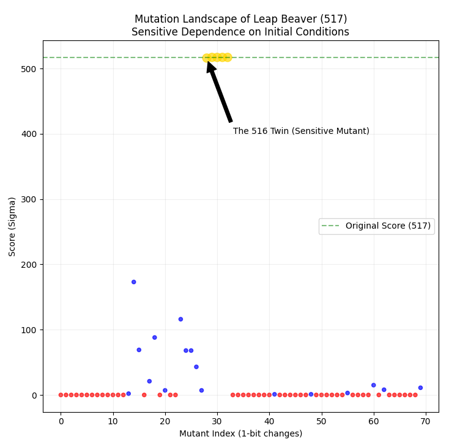

# Leap Beaver: High-Performance Search in 2-State 5-Symbol TMs 🦫

This repository hosts the implementation of the **Leap Beaver** search algorithm. The core search engine is implemented in **C++** for performance, with **Python** scripts provided for behavioral verification and fitness landscape analysis.

## 🏆 Key Findings
- **Champion Machine:** Found a machine with a halting score of **$\Sigma = 517$**.
- **Architecture:** 2-State, 5-Symbol (Adaptive movement logic).
- **Complexity:** Analysis reveals a highly "rugged" fitness landscape with an isolated peak.

## 📊 Visualizations

### 1. Fitness Landscape & Topology
The analysis confirms the "Twin" anomaly and the extreme sensitivity of the configuration space (Rugged Landscape):


*(Figure: The Mutation Landscape of Leap Beaver (517)*

### 2. Space-Time Dynamics
We compare the space-time dynamics of the Champion ($\Sigma=517$) against the Chaos machine ($\Sigma=280$). Both exhibit intricate, non-repetitive patterns before halting, as visualized below.


*(Figure: Space-Time diagram showing symbol patterns. The distinct colors represent different symbols written on the tape.)*

## 🚀 Project Structure
- `cpp/`: Core search engine and simulation logic (C++17).
- `python/`: Verification tools and plotting scripts (NumPy/Matplotlib).

## 🛠️ Usage

### 1. C++ Core (Search & Simulation)
Navigate to the `cpp` directory to compile and run the main engine:

```bash
cd cpp
g++ -O3 main.cpp -o leap_beaver
./leap_beaver
