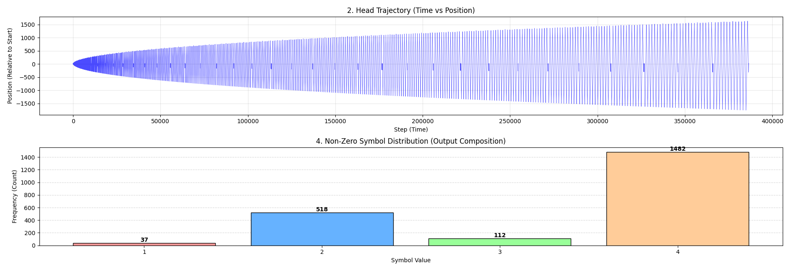
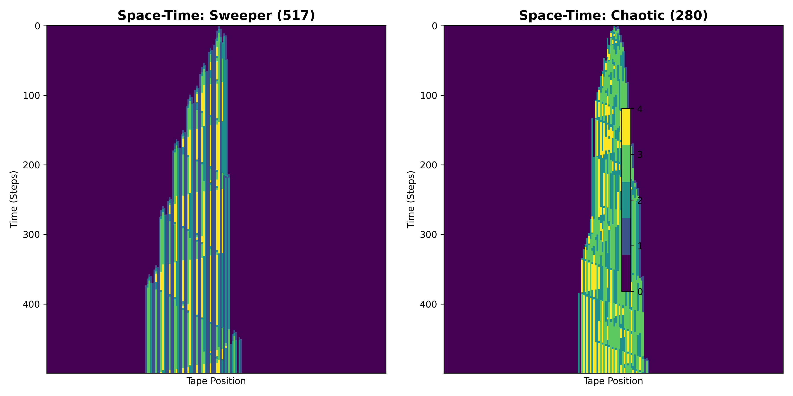

# Leap Beaver: High-Performance Search in Nonlocal TMs 🦫

This repository hosts the implementation of the **Leap Beaver** search algorithm. The core search engine is implemented in **C++** for performance, with **Python** scripts provided for behavioral verification and fitness landscape analysis.

## 🏆 Current Discovery Records

We track the highest scores ($\Sigma$) discovered using our nonlocal jump architecture.

| States | Symbols | Score ($\Sigma$) | Steps | Transition Table (The "DNA") | Folder |
| :--- | :--- | :--- | :--- | :--- | :--- |
| 2 | 5 | **517** | 66,263 | `2LB 4LB 1LC 3RC 4RA \| 4RA 4RB 2LB 1LB 4LB` | [`/2-state`](./2-state-results) |
| **3** | **5** | **2,149** | **386,484** | `2LB 4LB 1LC 3RC 4RA \| 4RA 4RB 2LB 1LB 4LB \| 2RB 2RH 4RC 2RB 3RB` | [`/3-state`](./3-state-results) |

> **Note:** Transition format: `[Write][Move][NextState]`. For Leap Beaver, `Move` represents a jump distance equal to the symbol value. `H` denotes the Halt state.

---

## 📊 Visualizations

### 1. 3-State Record ($\Sigma=2,149$)
The latest discovery demonstrates the scaling potential of nonlocal motion. The visualization below captures the **Head Trajectory** and **Non-zero Symbol Distribution**, revealing an "Expanding Oscillator" behavior. This pattern shows how the machine systematically structures the tape through nonlocal jumps before reaching the halt state.


*(Figure: Multi-panel analysis of the 2,149-score machine, showing the space-time trajectory and the frequency of symbols written on the tape.)*


### 2. 2-State Fitness Landscape & Topology
Analysis of the 2-state 517-score machine confirms a "Rugged" landscape with extreme sensitivity to mutations:

*(Figure: The Mutation Landscape of Leap Beaver (517))*


### 3. Space-Time Dynamics (2-State)
Comparison between the Champion ($\Sigma=517$) and a Chaos-variant ($\Sigma=280$).

*(Figure: Space-Time diagram showing symbol patterns. Distinct colors represent different symbols.)*

## 🚀 How to Read the Transition Table

Our machines use a custom **Symbol-Dependent Leap** logic. For a state $Q$ and read symbol $S$:
- **Write:** The symbol to be written on the current cell.
- **Move:** `L` (Left) or `R` (Right). The distance is determined by the **value of the symbol just written**.
- **Next State:** The state to transition into (A, B, C... or H for Halt).

**Example:** `2LB` means "Write 2, Jump Left by 2 spaces, switch to State B".

## 🚀 Project Structure
- `cpp/`: Core search engine and simulation logic (C++17).
- `python/`: Verification tools and plotting scripts (NumPy/Matplotlib).
- `2-state-results/`: Metadata and transition tables for 2-state findings.
- `3-state-results/`: Metadata and transition tables for 3-state findings.

## 🛠️ Usage

### 1. C++ Core (Search & Simulation)
```bash
cd cpp
g++ -O3 main.cpp -o leap_beaver
./leap_beaver
